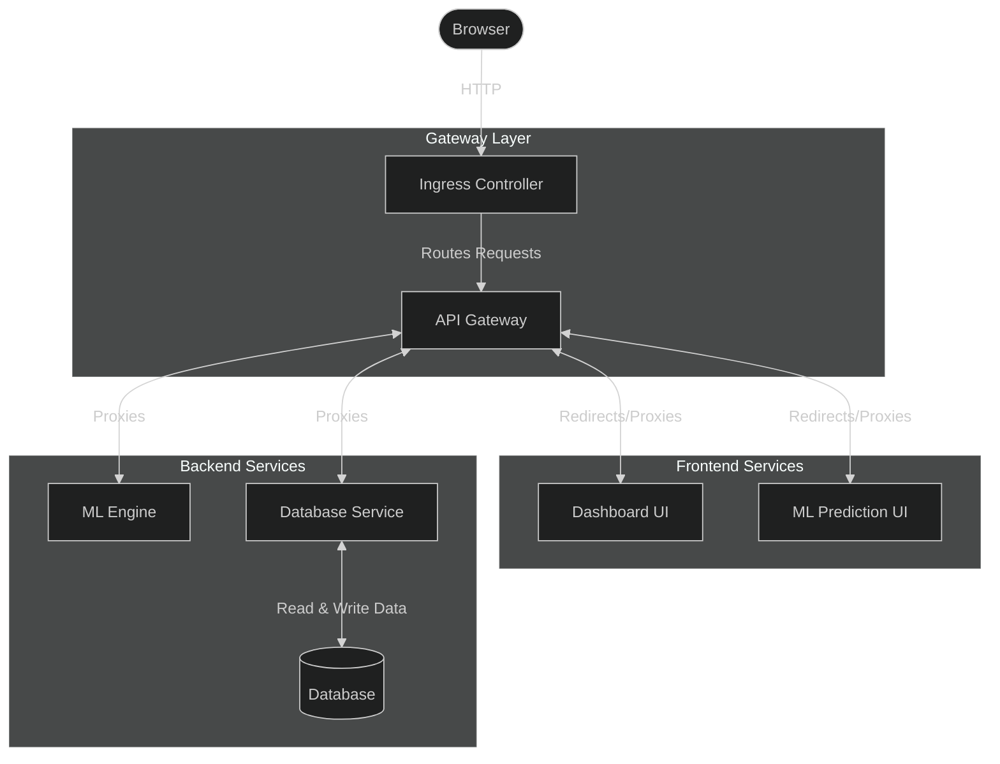

# Project Overview
An end-to-end AI pipeline designed to predict customer churn in real time. Built on a microservice architecture, it addresses core operational issues felt by large enterprise businesses with dynamic customer bases by analysing if customers will churn using an AI model. 

## Project Objectives
- Batch Processing: Ability for users to add in new datasets and do batch prediction through the use of csv files.
- Self-Service Data Analytics: Provide managers and analysts with an interactive dashboard to build custom charts, explore custom parameters, and analyse churn trends on demand. 
- Decoupled Architecture: Maintain scalability, reliability and fault tolerance across the system through 5 decoupled microservices (API Gateway, Database, ML Engine, ML Prediction, Dashboard 
- Ability to retrain Model: Ability to retrain and update the model with new data ingested.

# Repo Directory Structure
```text
├── data
│   ├── generate_test_data
│   │   ├── generate_customers_no_churn_values.py
│   │   └── generate_customers_with_churn_values.py
│   ├── telco_data
│   │   ├── CustomerChurn.xlsx
│   │   ├── Telco_customer_churn_demographics.xlsx
│   │   ├── Telco_customer_churn_location.xlsx
│   │   ├── Telco_customer_churn_population.xlsx
│   │   ├── Telco_customer_churn_services.xlsx
│   │   ├── Telco_customer_churn_status.xlsx
│   │   └── Telco_customer_churn.xlsx
│   ├── Company_Data(For ML Prediction).csv
│   └── generated_customers.csv
├── k8s
│   ├── api-gateway.yaml
│   ├── dashboard.yaml
│   ├── database.yaml
│   ├── ingress.yaml
│   ├── ml-engine.yaml
│   └── ml-prediction.yaml
├── services
│   ├── api_gateway
│   │   ├── templates
│   │   │   ├── database_gateway.html
│   │   │   ├── index.html
│   │   │   ├── ml_gateway.html
│   │   │   └── readme.html
│   │   ├── api_gateway.py
│   │   ├── config.py
│   │   ├── Dockerfile
│   │   ├── README.md
│   │   └── requirements.txt
│   ├── dashboard
│   │   ├── app.py
│   │   ├── data_access.py
│   │   ├── Dockerfile
│   │   ├── README.md
│   │   └── requirements.txt
│   ├── database
│   │   ├── api
│   │   │   ├── database_services.py
│   │   │   ├── Dockerfile
│   │   │   └── requirements.txt
│   │   ├── init_scripts
│   │   │   ├── 01-schema.sql
│   │   │   └── 02-seed.sql
│   │   ├── loader
│   │   │   ├── data_files
│   │   │   │   ├── CustomerChurn.xlsx
│   │   │   │   ├── Telco_customer_churn_demographics.xlsx
│   │   │   │   ├── Telco_customer_churn_location.xlsx
│   │   │   │   ├── Telco_customer_churn_population.xlsx
│   │   │   │   ├── Telco_customer_churn_services.xlsx
│   │   │   │   ├── Telco_customer_churn_status.xlsx
│   │   │   │   └── Telco_customer_churn.xlsx
│   │   │   ├── Dockerfile
│   │   │   ├── load_data.py
│   │   │   └── requirements.txt
│   │   ├── .dockerignore
│   │   ├── Dockerfile
│   │   └── README.md
│   ├── ml_engine
│   │   ├── model
│   │   │   └── .gitkeep
│   │   ├── app.py
│   │   ├── config.py
│   │   ├── Dockerfile
│   │   ├── README.md
│   │   ├── requirements.txt
│   │   └── train.py
│   └── ml_prediction
│       ├── config.py
│       ├── data_access.py
│       ├── Dockerfile
│       ├── prediction.py
│       ├── README.md
│       └── requirements.txt
├── .env.example
├── .gitignore
├── compose.yaml
├── docker_db_loader.ps1
├── docker_db_loader.sh
├── docker_rebuild.ps1
├── docker_rebuild.sh
├── docker_setup.ps1
├── docker_setup.sh
├── docker_stop.ps1
├── docker_stop.sh
├── k8s_db_loader.ps1
├── k8s_db_loader.sh
├── k8s_delete_all.ps1
├── k8s_delete_all.sh
├── k8s_redeploy.ps1
├── k8s_redeploy.sh
├── k8s_setup.ps1
├── k8s_setup.sh
├── nginx.conf
└── README.md
```


## Application Setup & Management Guide

## Command Flags Format

When running scripts, pass optional flags using the syntax for your platform:

| Platform | Flag Syntax Example |
| :--- | :--- |
| **Windows (PowerShell)** | `.\script.ps1 -FullDelete` |
| **macOS / Linux (Bash)** | `bash script.sh --FullDelete` |

---

## Docker Setup & Management

### Prerequisites
Download and install **Docker Desktop** for your operating system from the [Official Docker Website](https://www.docker.com/products/docker-desktop/).

---

### Scripts Reference

#### Initial Setup
Initialises and starts the entire application stack for the first time

* **Windows:**
  ```powershell
  .\docker_setup.ps1
  ```
* **Linux / macOS:**
  ```bash
  bash docker_setup.sh
  ```

---

#### Rebuild Script
Rebuilds Docker images to update container source code

* **Optional Flags:**
  * `-SeedDb` / `--SeedDb`: Runs the database loader to load the database if necessary.

* **Windows:**
  ```powershell
  .\docker_rebuild.ps1
  # Example with flags:
  .\docker_rebuild.ps1 -SeedDb
  ```
* **Linux / macOS:**
  ```bash
  bash docker_rebuild.sh
  # Example with flags:
  bash docker_rebuild.sh --SeedDb
  ```

---

#### Database Loader Script
Manually executes the database loader script to load the database

* **Windows:**
  ```powershell
  .\docker_db_loader.ps1
  ```
* **Linux / macOS:**
  ```bash
  bash docker_db_loader.sh
  ```

---

#### Stop Script
Stops all running Docker containers

* **Optional Flags:**
  * `-Wipe` / `--Wipe`: Permanently deletes all persistent volumes and data

* **Windows:**
  ```powershell
  .\docker_stop.ps1
  # Example with flags:
  .\docker_stop.ps1 -Wipe
  ```
* **Linux / macOS:**
  ```bash
  bash docker_stop.sh
  # Example with flags:
  bash docker_stop.sh --Wipe
  ```

---

## Kubernetes Reference & Setup

### Installing Kubernetes

* **Windows:**
  ```powershell
  winget install Kubernetes.kubectl
  winget install Kubernetes.minikube
  ```

* **macOS:**
  ```bash
  brew install kubectl
  brew install minikube
  ```

* **Linux:**
  ```bash
  # Install kubectl
  curl -LO "https://dl.k8s.io/release/$(curl -L -s https://dl.k8s.io/release/stable.txt)/bin/linux/amd64/kubectl"
  sudo install -o root -g root -m 0755 kubectl /usr/local/bin/kubectl

  # Install minikube
  curl -LO https://storage.googleapis.com/minikube/releases/latest/minikube-linux-amd64
  sudo install minikube-linux-amd64 /usr/local/bin/minikube
  ```

---

### Kubernetes Scripts Reference

#### First-Time Setup Script
Sets up and launches the Minikube cluster and initial resources for the first time

* **Windows:**
  ```powershell
  .\k8s_setup.ps1
  ```
* **Linux / macOS:**
  ```bash
  bash k8s_setup.sh
  ```

---

#### Redeploy Script
Triggers a rolling redeployment to apply updates to cluster resources with zero downtime

* **Optional Flags:**
  * `-BuildImages` / `--BuildImages`: Rebuilds Docker images and loads them into Minikube. Use after modifying source code.
  * `-SeedDb` / `--SeedDb`: Re-runs the database loader job. Use if the PVC has been deleted and needs formatting.

* **Windows:**
  ```powershell
  .\k8s_redeploy.ps1
  # Example with flags:
  .\k8s_redeploy.ps1 -BuildImages -SeedDb
  ```
* **Linux / macOS:**
  ```bash
  bash k8s_redeploy.sh
  # Example with flags:
  bash k8s_redeploy.sh --BuildImages --SeedDb
  ```

---

#### Database Loader Script
Re-runs the `db_loader` job to load the database manually if necessary

* **Windows:**
  ```powershell
  .\k8s_db_loader.ps1
  ```
* **Linux / macOS:**
  ```bash
  bash k8s_db_loader.sh
  ```

---

#### Delete All Script
Deletes all Kubernetes resources within the cluster for a clean reinstall

* **Optional Flags:**
  * `-FullDelete` / `--FullDelete`: Deletes the entire Minikube cluster 

* **Windows:**
  ```powershell
  .\k8s_delete_all.ps1
  # Example with flags:
  .\k8s_delete_all.ps1 -FullDelete
  ```
* **Linux / macOS:**
  ```bash
  bash k8s_delete_all.sh
  # Example with flags:
  bash k8s_delete_all.sh --FullDelete
  ```

## System Architecture Flowchart



## Microservices Overview

* **db-loader**: One-off job to load and populate the SQL database from the raw Excel files
* **database**: SQL database engine that stores all persistent application data
* **database-service**: Internal routing and communication layer for database access
* **ml-engine-service**: Machine learning engine responsible for model training and predictions
* **ml-prediction-service**: User-facing service that accepts customer information inputs to run predictions
* **dashboard-service**: Analytics service enabling users to build custom charts and visualise data
* **api-gateway-service**: Main entry point that routes external traffic and coordinates communication between services

## Dataset Information

* **Primary Datasets:**
  * `Telco_customer_churn_demographics.xlsx`
  * `Telco_customer_churn_services.xlsx`
  * `Telco_customer_churn_status.xlsx`
  * `Telco_customer_churn_location.xlsx`
  * **Source:** [IBM Accelerator Catalog](https://accelerator.ca.analytics.ibm.com/bi/?perspective=authoring&pathRef=.public_folders%2FIBM%2BAccelerator%2BCatalog%2FContent%2FDAT00148&id=i9710CF25EF75468D95FFFC7D57D45204)

* **Additional Files & Assets:**
  1. **Secondary Dataset Directory:** A folder containing a copy of the data is located in `/services/database/loader` for the one time kubernetes job to load in the datasets and merge them into 1 table
  2. **Data Generator Scripts:** Two Python scripts located in `/data/generate_test_data` create artificial datasets for evaluating bulk input processing for the database and machine learning engine


## Known Issues & Limitations

* **Incomplete Data Extraction:** During the initial data merging and extraction phase, comprehensive feature extraction was not performed. As a result, certain columns and potentially predictive features from the raw dataset were excluded during the `db-loader` process. This may limit the model's current predictive scope and future iterations will address this to capture the complete dataset
* **Class Imbalance:** The loaded dataset exhibits a class imbalance of approximately 73% retained vs. 27% churned. Without optimised class weight adjustments, the ML model may skew towards predicting retention and potentially fail to identify churn customers.